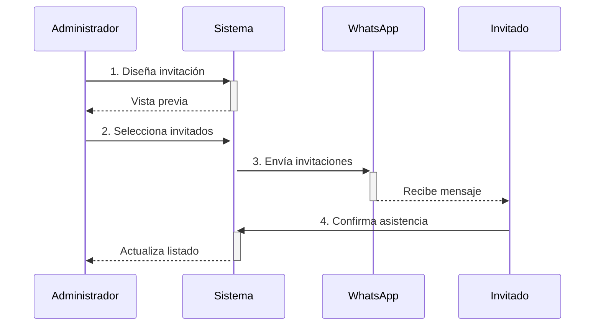

## 📋 Tabla de Contenidos
- [Descripción](#-descripción)
- [Componentes](#-componentes)
- [Flujo de Trabajo](#-flujo-de-trabajo)
- [Estructura de Archivos](#-estructura-de-archivos)
- [Configuración](#-configuración)
- [Uso](#-uso)
- [Dependencias](#-dependencias)
- [FAQ](#-faq)

## 🌟 Descripción
Sistema completo para gestionar invitaciones digitales, confirmaciones y listado de invitados para eventos. Permite:

- ✉️ Enviar invitaciones personalizadas por WhatsApp
- ✅ Recibir confirmaciones con número de acompañantes
- 📊 Generar reportes de asistencia
- 🎨 Diseñar la tarjeta de invitación
- 📱 Experiencia mobile-first para invitados

## 🧩 Componentes

### 1. `01-AListaInvitados.jsx`
**Propósito**: Vista administrativa principal  
**Funcionalidades**:
- Filtrado por grupo/relación
- Visualización de estado (confirmado/pendiente)
- Exportación a Excel
- Acceso rápido a otras vistas

### 2. `BCrearTarjetaInvitacionPrevisualizacionInvitacion.jsx`
**Propósito**: Diseñar la invitación  
**Características**:
- Editor de mensaje principal
- Configuración de fecha/lugar
- Vista previa en tiempo real

### 3. `03-CEnviarTarjetaWhattsapp.jsx`
**Propósito**: Envío masivo de invitaciones  
**Funcionalidades**:
- Selección de invitados
- Generación automática de mensaje
- Integración con WhatsApp API

### 4. `BCrearTarjetaInvitacion.jsx`
**Propósito**: Vista del invitado  
**Contenido**:
- Mensaje personalizado
- Detalles del evento
- Botón de confirmación

### 5. `BCrearTarjetaInvitacionConfirmAsist.jsx`
**Propósito**: Formulario de confirmación  
**Campos**:
- Número de acompañantes
- Alergias/preferencias alimentarias
- Mensaje opcional

### 6. `ListadeConfirmaciones.jsx`
**Propósito**: Panel de confirmados  
**Estadísticas**:
- Total invitados vs confirmados
- Porcentaje de asistencia
- Listado filtrable

## 🔄 Flujo de Trabajo



## 📂 Estructura de Archivos

```
src/
├── componentes/
│   ├── 01-AListaInvitados.jsx
│   ├── BCrearTarjetaInvitacionPrevisualizacionInvitacion.jsx
│   ├── 03-CEnviarTarjetaWhattsapp.jsx
│   ├── BCrearTarjetaInvitacion.jsx
│   ├── BCrearTarjetaInvitacionConfirmAsist.jsx
│   └── ListadeConfirmaciones.jsx
├── assets/
│   └── scss/
│       └── _03-Componentes/
│           ├── _01-AListaInvitados.scss
│           ├── _BCrearTarjetaInvitacion.scss
│           └── ...otros SCSS
public/
└── invitados.json
```

src/componentes/
├── 01-AListaInvitados.jsx          # Lista principal con filtros
├── ListadeConfirmaciones.jsx   # Solo invitados confirmados
├── BCrearTarjetaInvitacion.jsx       # Vista de invitación (para invitados)
├── BCrearTarjetaInvitacionConfirmAsist.jsx  # Formulario de confirmación
├── 03-CEnviarTarjetaWhattsapp.jsx # Panel de envío por WhatsApp
└── BCrearTarjetaInvitacionPrevisualizacionInvitacion.jsx # Diseño de invitación


. Configurar datos iniciales:
   - Editar `public/invitados.json` con tu lista de invitados
   ```json
   {
     "grupos": [
       {
         "nombre": "Familia",
         "invitados": [
           {
             "id": 1,
             "nombre": "Ejemplo Invitado",
             "relacion": "Familiar",
             "contacto": {
               "whatsapp": "+549123456789"
             }
           }
         ]
       }
     ]
   }
   ```

2. **Flujo típico**:
     - Navegar a "Enviar Invitaciones"
   - Diseñar tarjeta y seleccionar destinatarios
   - Enviar por WhatsApp
   - Los invitados confirman asistencia
   - Ver confirmaciones en panel correspondiente

3. **Generar reporte Excel**:
   - Desde `01-AListaInvitados`, click en "Exportar Excel"


# tarjetasinvitaciones
